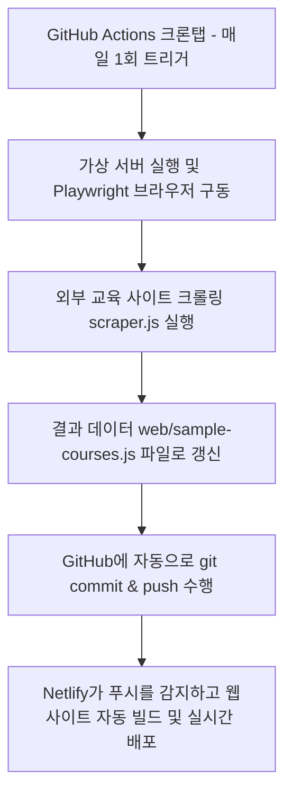

# 🌐 웹 배포 플랫폼 제안 및 실시간 크롤링 자동화 가이드

본 문서에서는 완성된 반도체 후공정(PKG) 사외 교육 추천 시스템을 팀원 및 사내 구성원에게 공유하기 위한 **웹 호스팅 플랫폼 제안**과, 외부 교육 정보를 주기적으로 갱신하기 위한 **크롤러 자동 주기적 실행(GitHub Actions) 파이프라인 구축 안**을 제안합니다.

---

## 1. 웹 호스팅 플랫폼 제안: Netlify vs Vercel

두 플랫폼 모두 GitHub 저장소와 연동하여 코드 푸시(`git push`) 시 자동으로 웹사이트를 빌드 및 배포해주는 글로벌 최고 수준의 무료 호스팅 플랫폼입니다. 프로젝트 특성상 **순수 정적 SPA(HTML/CSS/JS)**이므로 둘 다 매우 훌륭한 선택이나, 몇 가지 차이점이 존재합니다.

### 📊 비교 분석 표

| 비교 항목 | Netlify (넷리파이) | Vercel (버셀) |
| :--- | :--- | :--- |
| **적합성** | 정적 웹사이트 및 SPA 배포 최적화 | React, Next.js 등 JS 프레임워크 최적화 |
| **도메인 제공** | `[프로젝트명].netlify.app` 무상 제공 | `[프로젝트명].vercel.app` 무상 제공 |
| **폼 서브미션** | **Netlify Forms 무상 지원** (DB 없이 Q&A 저장 가능) | 별도 3rd party API(Formspree 등) 필요 |
| **속도/CDN** | 글로벌 CDN 우수 (안정적) | 에지 인프라 매우 우수 (약간 더 신속) |
| **연동 난이도** | 깃허브 계정 연동 후 클릭 몇 번으로 즉시 완료 | 넷리파이와 동일하게 매우 쉬움 |

### 💡 최종 제안: Netlify (넷리파이) 추천
기존 벤치마크 사이트인 `tsp-people-education.netlify.app` 역시 **Netlify**를 통해 배포되었습니다. 
특히 나중에 Q&A 게시판이나 리뷰 작성 내용을 구글 시트나 이메일로 받아보고 싶을 때, Netlify가 제공하는 **Netlify Forms** 기능을 사용하면 **백엔드 서버나 DB 구축 없이 HTML 태그 수정만으로 데이터를 즉시 수집**할 수 있어 정적 웹사이트 배포에 가장 편리합니다.

---

## 2. 실시간 크롤링 주기적 자동화 방안: GitHub Actions 활용

배포된 Netlify 사이트는 **정적 사이트(Static Site)**이기 때문에, 서버가 백그라운드에서 직접 크롤러(`scraper.js`)를 실행할 수 없습니다. 
따라서, **GitHub Actions(깃허브 액션)**의 크론탭(Cron) 기능을 이용하여 매일 지정된 시간에 크롤러를 돌린 후, 갱신된 `sample-courses.js` 데이터를 저장소에 커밋 및 푸시하는 방식을 사용해야 합니다.

### 🔄 전체 데이터 흐름도



이 방식을 이용하면 **별도의 유료 클라우드 서버(AWS 등) 운영 비용이 전혀 없이 100% 무료**로 배포 및 실시간 크롤링 자동화를 완료할 수 있습니다.

---

## 3. GitHub Actions 자동화 파일 생성 및 설정 방법

저장소 루트에 `.github/workflows/` 폴더를 생성하고 아래 설정 파일을 저장하여 푸시하면, 깃허브가 매일 자동으로 크롤링을 돌리고 사이트를 갱신합니다.

### 📄 `.github/workflows/scrape_daily.yml` 파일 내용

```yaml
name: Daily Semiconductor Education Scraper

on:
  schedule:
    # 매일 한국 시간(KST) 오전 9시 (UTC 00:00)에 자동 실행
    - cron: '0 0 * * *'
  # GitHub 웹사이트에서 수동으로 즉시 실행할 수도 있게 설정
  workflow_dispatch:

jobs:
  scrape-and-update:
    runs-on: ubuntu-latest

    steps:
    # 1. 소스 코드 다운로드
    - name: Checkout repository
      uses: actions/checkout@v4

    # 2. Node.js 환경 구축
    - name: Set up Node.js
      uses: actions/setup-node@v4
      with:
        node-version: '20'

    # 3. 크롤러 폴더의 의존성 라이브러리 설치
    - name: Install dependencies
      run: |
        cd crawler
        npm install

    # 4. Playwright 구동용 Chromium 브라우저 바이너리 설치
    - name: Install Playwright Browsers
      run: |
        cd crawler
        npx playwright install chromium --with-deps

    # 5. 크롤링 스크립트 실행 (web/sample-courses.js 자동 업데이트)
    - name: Run Scraper
      run: |
        cd crawler
        node scraper.js

    # 6. 변경된 데이터가 있을 경우 깃허브에 자동으로 커밋 및 푸시
    - name: Commit and Push changes
      run: |
        git config --global user.name "github-actions[bot]"
        git config --global user.email "41898282+github-actions[bot]@users.noreply.github.com"
        git add web/sample-courses.js
        # 변경 사항이 있을 때만 커밋 수행 (에러 방지)
        git diff-index --quiet HEAD || git commit -m "Auto-update scraped courses data"
        git push origin main
```

### 🛠️ 설정 체크리스트
1. **GitHub Repository 권한 변경**:
   GitHub 저장소의 `Settings` ➔ `Actions` ➔ `General` ➔ `Workflow permissions`에서 **"Read and write permissions"**에 체크를 한 뒤 Save 버튼을 눌러야 봇이 업데이트 파일을 깃허브 저장소에 커밋/푸시할 수 있습니다.
2. **Netlify 연동**:
   Netlify 사이트에 접속해 `Add new site` ➔ `Import an existing project` ➔ `GitHub`를 연동하고 저장소와 `main` 브랜치를 지정하면 끝납니다. 빌드 설정은 기본값(정적 HTML이므로 Build Command: 비워둠, Publish directory: `web`)으로 지정하시면 배포가 완료됩니다.
